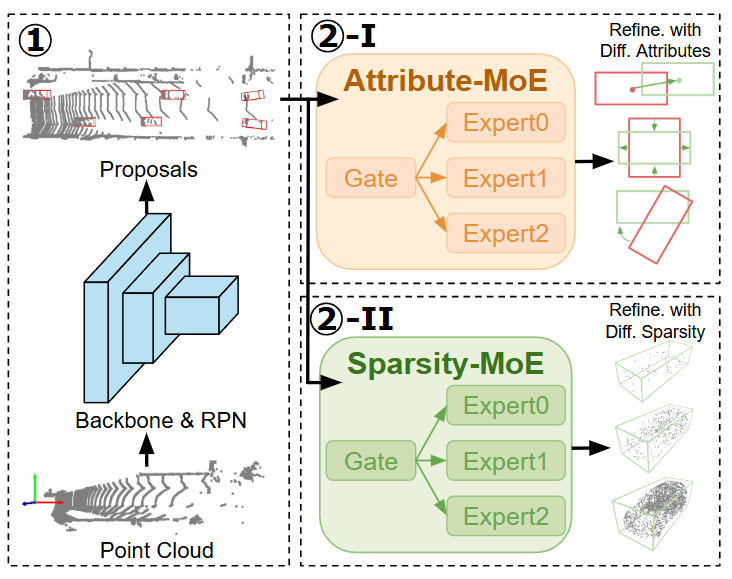

# Rethinking the Refinement Stage of 3D Object Detection: A Multi-Task Learning Perspective with Mixture-of-Experts

This is the official implementation of `RefineMoE`, our paper on enhancing two-stage 3D object detection.

`RefineMoE` introduces a Multi-Task Learning approach to the refinement stage of 3D object detectors. We address two core challenges: conflicting regression objectives (inter-attribute conflict) and inconsistent point cloud densities across proposals (inter-sample conflict). Our solution leverages specialized Mixture-of-Experts (MoE) architectures: Attribute-MoE (AM) to decouple attribute regression, and Sparsity-MoE (SM) for adaptive, density-aware refinement. RefineMoE consistently boosts performance on KITTI and Waymo datasets, providing a modular "toolbox" for mitigating negative transfer and fostering more adaptive 3D detection systems.

`RefineMoE` seamlessly integrates into existing two-stage 3D detectors to significantly improve their performance. This codebase is built upon [mmdetection3d](https://github.com/open-mmlab/mmdetection3d) and [FSHNet](https://github.com/Say2L/FSHNet).

## Overview
- [Framework](#framework)
- [Model Zoo](#model-zoo)
- [Getting Started](#getting-started)
- [Acknowledgement](#acknowledgement)

## Framework
Two-stage LiDAR-based 3D object detectors have achieved state-of-the-art accuracy, yet their performance is often limited by the refinement stage. In this work, we revisit 3D object refinement from a Multi-Task Learning perspective and identify two independent sources of negative transfer: an \textbf{inter-attribute conflict}, where heterogeneous regression objectives (e.g., center, size, orientation) interfere during joint optimization, and an \textbf{inter-sample conflict}, where proposals with varying point densities lead to gradient imbalance. To address these issues, we introduce two specialized Mixture-of-Experts architectures. The \textbf{Attribute-MoE} decouples regression objectives into dedicated expert branches to alleviate feature conflicts, while the \textbf{Sparsity-MoE} employs density-aware experts to adaptively refine proposals according to point sparsity. Integrated into strong two-stage baselines, our modules consistently improve performance on the KITTI and Waymo datasets. Beyond empirical gains, our analysis reveals that Attribute-MoE and Sparsity-MoE solve largely independent problems, offering a practical ``toolbox'' for mitigating negative transfer in 3D object refinement and advancing adaptive, task-aware detector design.



## Update Log
* 2025/10/22: Initial release of codes and models.

## Model Zoo
Below are the 3D detection performance (AP R40) for the Car class, averaged on the KITTI validation set.

#### PV-RCNN vs. PV-RCNN-RefineMoE 
| Detectors      | Easy  | Moderate | Hard  | Download (Google Drive)                                     | Download (Baidu Netdisk)                                    |
|:---------------|:------:|:--------:|:------:|:-----------------------------------------------------------:|:-----------------------------------------------------------:|
| PV-RCNN baseline | 91.86 | 82.66    | 80.51 |                                                             |                                                             |
| PV-RCNN-AM     | 91.70 | 82.86    | 80.71 | [Google](https://drive.google.com/drive/folders/1i2_mllETqIEuaPYAHtHToiQNn9xg3Uhl?usp=sharing) | [Baidu](https://pan.baidu.com/s/1JxszmJ5U-b9hRYxrKEZV-A?pwd=rdb2) |
| PV-RCNN-SM     | 92.10 | 82.94    | 82.20 | [Google](https://drive.google.com/drive/folders/1i2_mllETqIEuaPYAHtHToiQNn9xg3Uhl?usp=sharing) | [Baidu](https://pan.baidu.com/s/1JxszmJ5U-b9hRYxrKEZV-A?pwd=rdb2) |

#### VoxelRCNN vs. VoxelRCNN-RefineMoE
| Detectors       | Easy  | Moderate | Hard  | Download (Google Drive)                                     | Download (Baidu Netdisk)                                    |
|:----------------|:------:|:--------:|:------:|:-----------------------------------------------------------:|:-----------------------------------------------------------:|
| VoxelRCNN baseline | 92.00 | 84.98    | 82.76 |                                                             |                                                             |
| VoxelRCNN-AM    | 92.37 | 85.35    | 82.98 | [Google](https://drive.google.com/drive/folders/1i2_mllETqIEuaPYAHtHToiQNn9xg3Uhl?usp=sharing) | [Baidu](https://pan.baidu.com/s/1JxszmJ5U-b9hRYxrKEZV-A?pwd=rdb2) |
| VoxelRCNN-SM    | 92.51 | 85.20    | 83.03 | [Google](https://drive.google.com/drive/folders/1i2_mllETqIEuaPYAHtHToiQNn9xg3Uhl?usp=sharing) | [Baidu](https://pan.baidu.com/s/1JxszmJ5U-b9hRYxrKEZV-A?pwd=rdb2) |

Below are the 3D detection performance (AP and APH) for the Car class on a 10-frame interval subset of the Waymo validation set.

#### FSHNet vs. FSHNet-RefineMoE
| Detectors      | AP (L1) | APH (L1) | AP (L2) | APH (L2) | Download (Google Drive)                                     | Download (Baidu Netdisk)                                    |
|:---------------|:-------:|:--------:|:-------:|:--------:|:-----------------------------------------------------------:|:-----------------------------------------------------------:|
| FSHNet baseline | 75.0    | 74.5     | 66.6    | 66.1     |                                                             |                                                             |
| FSHNet-two-stage | 76.5    | 76.1     | 68.1    | 67.7     | [Google](https://drive.google.com/drive/folders/1i2_mllETqIEuaPYAHtHToiQNn9xg3Uhl?usp=sharing) | [Baidu](https://pan.baidu.com/s/1JxszmJ5U-b9hRYxrKEZV-A?pwd=rdb2) |
| FSHNet-AM      | 76.9    | 76.5     | 68.5    | 68.1     | [Google](https://drive.google.com/drive/folders/1i2_mllETqIEuaPYAHtHToiQNn9xg3Uhl?usp=sharing) | [Baidu](https://pan.baidu.com/s/1JxszmJ5U-b9hRYxrKEZV-A?pwd=rdb2) |
| FSHNet-SM      | 76.7    | 76.2     | 68.3    | 67.9     | [Google](https://drive.google.com/drive/folders/1i2_mllETqIEuaPYAHtHToiQNn9xg3Uhl?usp=sharing) | [Baidu](https://pan.baidu.com/s/1JxszmJ5U-b9hRYxrKEZV-A?pwd=rdb2) |

## Getting Started

### PV-RCNN Baseline Integration
1.  **Navigate to `mmdetection3d` directory and install PyTorch:**
    ```bash
    cd mmdetection3d
    conda create --name mm3d python=3.8
    conda activate mm3d
    pip install torch==1.8.0+cu111 torchvision==0.9.0+cu111 torchaudio==0.8.0 -f https://download.pytorch.org/whl/torch_stable.html
    ```
2.  **Install related packages:**
    ```bash
    pip install -U openmim 'numpy==1.23.0'
    mim install mmengine
    mim install 'mmcv==2.0.0rc4'
    mim install 'mmdet==3.0.0'
    ```
3.  **Set up the project:**
    ```bash
    pip install -v -e .
    pip install cumm-cu113
    pip install spconv-cu113
    ```
4.  **Verify successful installation (optional):**
    ```bash
    mim download mmdet3d --config pointpillars_hv_secfpn_8xb6-160e_kitti-3d-car --dest .
    python demo/pcd_demo.py demo/data/kitti/000008.bin pointpillars_hv_secfpn_8xb6-160e_kitti-3d-car.py hv_pointpillars_secfpn_6x8_160e_kitti-3d-car_20220331_134606-d42d15ed.pth
    ```
5.  **Link and preprocess KITTI dataset:**
    ```bash
    ln -s $YOUR_KITTI_DATASET_PATH$ data/kitti
    python tools/create_data.py kitti --root-path ./data/kitti --out-dir ./data/kitti --extra-tag kitti --with-plane
    ```
    Replace `$YOUR_KITTI_DATASET_PATH$` with the absolute path to your KITTI dataset.
6.  **Train the model:**
    ```bash
    python tools/train.py configs/RefineMoE/AM.py # for single GPU
    bash tools/dist_train.sh configs/RefineMoE/AM.py $NUM_GPUS$ # for multi-GPU training, replace $NUM_GPUS$ with the number of GPUs
    ```
7.  **Evaluate a checkpoint:**
    ```bash
    python tools/test.py configs/RefineMoE/AM.py $CHECKPOINT_PATH$ # for single GPU
    bash tools/dist_test.sh configs/RefineMoE/AM.py $CHECKPOINT_PATH$ $NUM_GPUS$ # for multi-GPU evaluation
    ```
    Replace `$CHECKPOINT_PATH$` with the path to your trained model checkpoint.

### VoxelRCNN Baseline Integration
1.  **Navigate to `FSHNet` directory and install PyTorch:**
    ```bash
    cd FSHNet
    conda create -n fshnet python=3.8
    conda activate fshnet
    # For compatibility, PyTorch version 1.9.0 or higher is recommended.
    pip install torch==1.10.0+cu111 torchvision==0.11.0+cu111 torchaudio==0.10.0 -f https://download.pytorch.org/whl/torch_stable.html
    ```
2.  **Install related packages:**
    ```bash
    pip install cumm-cu113
    pip install spconv-cu113
    pip install scikit-image pyyaml numba tensorboardX easydict
    python setup.py develop
    pip uninstall waymo-open-dataset-tf-2-4-0 # Ensure to uninstall older versions if present
    pip install waymo-open-dataset-tf-2-11-0
    pip install SharedArray==3.1.0
    pip install pyquaternion opencv-python
    pip install protobuf==3.20.3
    pip install triton==2.1.0
    pip install torch_scatter-2.0.9-cp38-cp38-linux_x86_64.whl # Download the appropriate wheel for your PyTorch and CUDA version
    pip install numba==0.48.0
    ```
3.  **Link and preprocess KITTI dataset:**
    ```bash
    ln -s $YOUR_KITTI_DATASET_PATH$ data/kitti
    python -m pcdet.datasets.kitti.kitti_dataset create_kitti_infos tools/cfgs/dataset_configs/kitti_dataset.yaml
    ```
    Replace `$YOUR_KITTI_DATASET_PATH$` with the absolute path to your KITTI dataset.
4.  **Train the model:**
    ```bash
    bash tools/scripts/dist_train.sh 4 --cfg_file tools/cfgs/voxelrcnn_kitti_models/am_kitti.yaml
    ```
5.  **Evaluate a checkpoint:**
    ```bash
    python tools/test.py --cfg_file tools/cfgs/voxelrcnn_kitti_models/am_kitti.yaml --ckpt $CHECKPOINT_PATH$
    ```
    Replace `$CHECKPOINT_PATH$` with the path to your trained model checkpoint.

### FSHNet Baseline Integration
1.  **Follow the environment setup steps for the VoxelRCNN baseline.**
2.  **Unzip and preprocess Waymo dataset:**
    ```bash
    tar -xvf archived_files_training_training_0000.tar -C $YOUR_WAYMO_DATASET_ROOT_PATH$/raw_data/ # Unzip all .tar files into the specified directory. Example shown for one .tar.
    ln -s $YOUR_WAYMO_DATASET_ROOT_PATH$ data/waymo
    python -m pcdet.datasets.waymo.waymo_dataset --func create_waymo_infos \
        --cfg_file tools/cfgs/dataset_configs/waymo_dataset.yaml
    ```
    Replace `$YOUR_WAYMO_DATASET_ROOT_PATH$` with the absolute path to your Waymo dataset.
3.  **Train the model:**
    ```bash
    bash tools/scripts/dist_train.sh 4 --cfg_file tools/cfgs/fshnet_rcnn_car_only_models/am_car_only.yaml
    ```
4.  **Evaluate a checkpoint:**
    ```bash
    python tools/test.py --cfg_file tools/cfgs/fshnet_rcnn_car_only_models/am_car_only.yaml --ckpt $CHECKPOINT_PATH$
    ```
    Replace `$CHECKPOINT_PATH$` with the path to your trained model checkpoint.

## Environment We Tested
**PV-RCNN Baseline:**
*   Ubuntu 18.04
*   Python 3.8.19
*   PyTorch 1.8.0+cu111
*   Numba 0.53.0
*   NVIDIA CUDA 11.3
*   4x NVIDIA GeForce RTX 3090 GPUs

**VoxelRCNN Baseline & FSHNet Baseline:**
*   Ubuntu 18.04
*   Python 3.8.19
*   PyTorch 1.10.0+cu111
*   Numba 0.48.0
*   NVIDIA CUDA 11.3
*   4x NVIDIA GeForce RTX 3090 GPUs

## Acknowledgement
We sincerely appreciate the following open-source projects for providing valuable and high-quality codes:
- [mmdetection3d](https://github.com/open-mmlab/mmdetection3d)
- [SST](https://github.com/tusen-ai/SST)
- [FSHNet](https://github.com/Say2L/FSHNet)